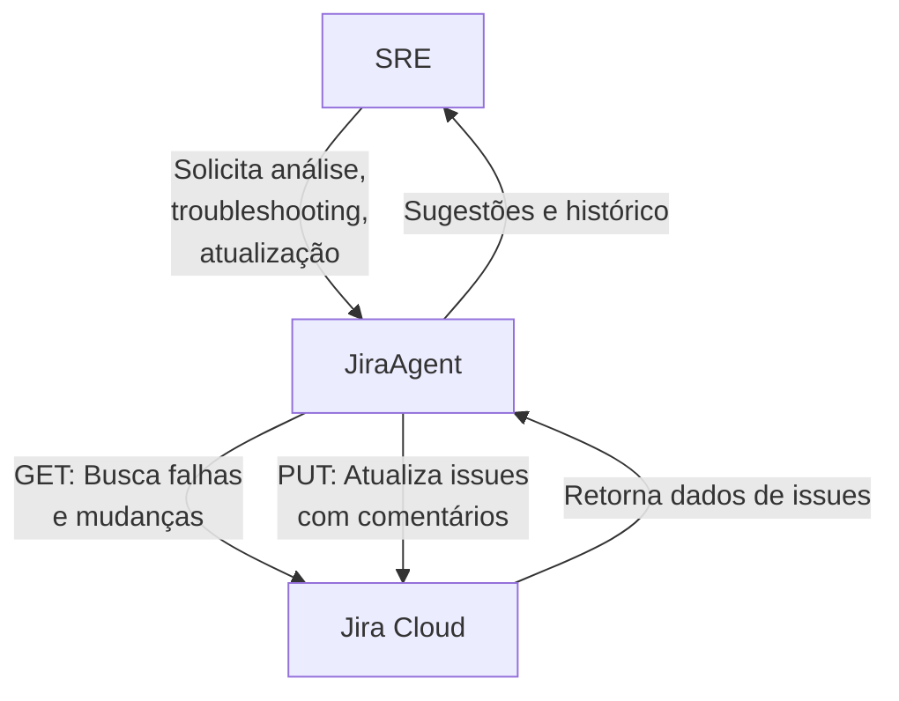

# Integração do JiraAgent para Troubleshooting

<!--
Este documento inclui:
- Passo a passo para integração do JiraAgent com Jira Cloud.
- Diagrama de arquitetura Mermaid.
- Exemplos de comandos GET e PUT para integração.
- Script Python de exemplo (jira_failed_changes.py) para consulta e sugestão de troubleshooting.
-->

## Passo a Passo da Integração

1. **Configuração do Jira**
   - Gere um token de API e obtenha as credenciais de acesso.
   - Identifique o projeto e os tipos de issue relevantes (ex: Change, Failed).

2. **Desenvolvimento do Agente**
   - Implemente o `JiraAgent` em Python para buscar mudanças e falhas via API REST do Jira.
   - Adicione métodos para sugerir troubleshooting com base em falhas conhecidas.

3. **Execução**
   - O agente consulta periodicamente o Jira para obter falhas recentes.
   - Técnicos podem consultar o agente para receber sugestões de troubleshooting.

4. **Resultados**
   - Redução do tempo de resolução de incidentes.
   - Compartilhamento de conhecimento sobre falhas recorrentes.

---

## Detalhamento da Integração

### 1. Interação SRE ↔️ JiraAgent

- O SRE executa comandos ou faz perguntas ao JiraAgent, por exemplo:
  - "Liste as últimas mudanças com falha"
  - "Sugira troubleshooting para erro de deploy"

- O JiraAgent interpreta a solicitação, consulta o Jira Cloud e retorna informações relevantes.

### 2. Interação JiraAgent ↔️ Jira Cloud

#### Exemplo de comando GET (Buscar mudanças com falha)

```http
GET /rest/api/2/search?jql=project=ITSM%20AND%20issuetype=Change%20AND%20status=Failed%20AND%20updated%3E=%222024-05-01%22&fields=key,summary,status,created,updated,description HTTP/1.1
Host: seu-jira.atlassian.net
Authorization: Basic <base64-usuario:token>
Accept: application/json
```

- O JiraAgent faz uma requisição GET para buscar issues de mudança com falha nos últimos 15 dias.

#### Exemplo de comando PUT (Atualizar uma issue com comentário de troubleshooting)

```http
PUT /rest/api/2/issue/ITSM-123/comment HTTP/1.1
Host: seu-jira.atlassian.net
Authorization: Basic <base64-usuario:token>
Content-Type: application/json

{
  "body": "Troubleshooting realizado: reiniciado serviço X, verificado log Y. Falha recorrente identificada conforme histórico."
}
```

- O JiraAgent pode registrar no Jira as ações tomadas ou sugestões fornecidas ao técnico.

---

## Script Python: jira_failed_changes.py

```python
# filepath: c:\Users\mbenedicto\Documents\Notebooks\jira_failed_changes.py
import requests
from datetime import datetime, timedelta

class JiraAgent:
    def __init__(self, jira_url, jira_user, jira_token, project_key):
        self.jira_url = jira_url
        self.jira_user = jira_user
        self.jira_token = jira_token
        self.project_key = project_key

    def get_failed_changes(self, days=15):
        hoje = datetime.now()
        data_inicio = (hoje - timedelta(days=days)).strftime('%Y-%m-%d')
        jql = (
            f'project = {self.project_key} AND issuetype = Change '
            f'AND status = Failed AND updated >= "{data_inicio}"'
        )
        url = f"{self.jira_url}/rest/api/2/search"
        headers = {"Accept": "application/json"}
        auth = (self.jira_user, self.jira_token)
        params = {
            "jql": jql,
            "fields": "key,summary,status,created,updated,description"
        }
        response = requests.get(url, headers=headers, params=params, auth=auth)
        if response.status_code == 200:
            return response.json().get("issues", [])
        else:
            print(f"Erro ao consultar Jira: {response.status_code} - {response.text}")
            return []

    def suggest_troubleshooting(self, issue_summary):
        # Busca falhas conhecidas relacionadas ao resumo informado
        issues = self.get_failed_changes()
        dicas = []
        for issue in issues:
            summary = issue['fields']['summary']
            description = issue['fields'].get('description', '')
            if issue_summary.lower() in summary.lower() or issue_summary.lower() in description.lower():
                dicas.append(f"{issue['key']}: {summary}\nDescrição: {description}")
        if not dicas:
            return "Nenhuma falha conhecida encontrada para esse caso."
        return "\n\n".join(dicas)

# Exemplo de uso do agente:
if __name__ == "__main__":
    # ...configurações do Jira...
    JIRA_URL = "https://seu-jira.atlassian.net"
    JIRA_USER = "seu-email@dominio.com"
    JIRA_TOKEN = "SEU_TOKEN_API"
    PROJECT_KEY = "SEU_PROJETO"  # Ex: "ITSM"

    agent = JiraAgent(JIRA_URL, JIRA_USER, JIRA_TOKEN, PROJECT_KEY)
    # Buscar todas as mudanças com falha nos últimos 15 dias
    failed_changes = agent.get_failed_changes()
    for issue in failed_changes:
        print(f"{issue['key']}: {issue['fields']['summary']} - {issue['fields']['status']['name']}")

    # Sugerir troubleshooting para um caso específico
    print("\nSugestão de troubleshooting para 'erro de deploy':")
    print(agent.suggest_troubleshooting("erro de deploy"))
```

---

## Diagrama de Arquitetura



---

## Benefícios para o Executivo

- **Automação**: Reduz esforço manual na busca de falhas conhecidas.
- **Agilidade**: Técnicos recebem recomendações rápidas e baseadas em histórico real.
- **Governança**: Facilita rastreabilidade e padronização do troubleshooting.
